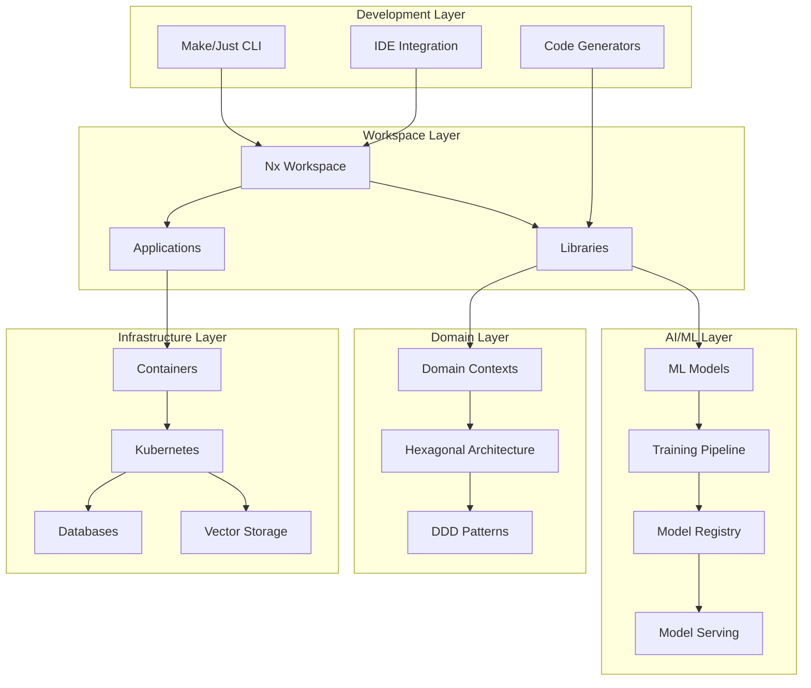
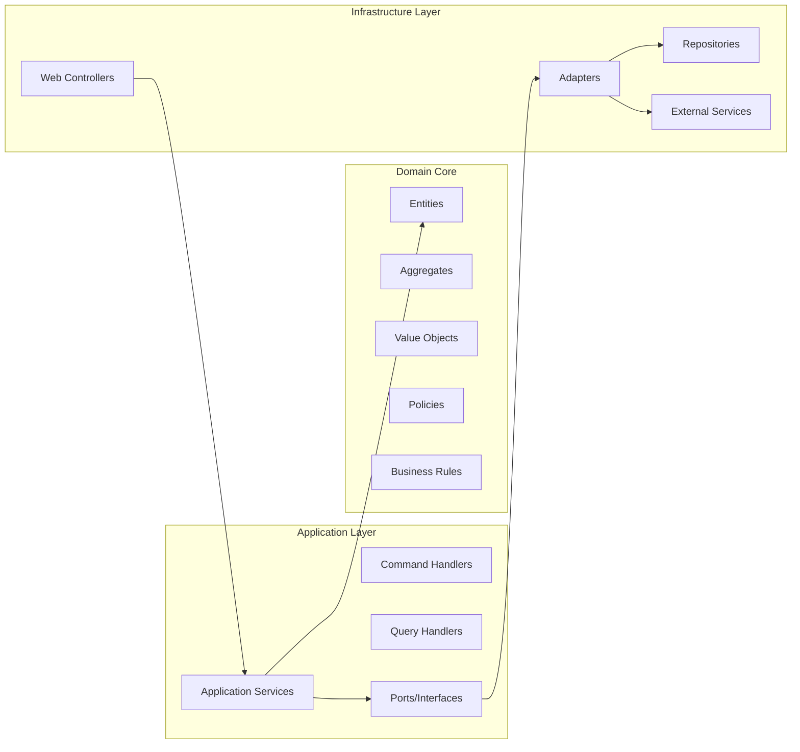
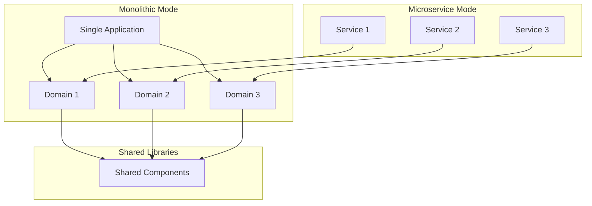

# Design Document

## Overview

The AI-Native Monorepo Starter Kit is designed as a comprehensive development platform that combines modern software architecture patterns with AI/ML capabilities. The system follows a layered architecture approach with clear separation of concerns, enabling both monolithic and microservice deployment patterns through a reversible architecture design.

The platform is built on top of Nx for workspace management, integrates multiple programming languages (Python, TypeScript), and provides extensive tooling for AI/ML model lifecycle management, containerization, and cloud deployment.

## Architecture

### High-Level Architecture



### Hexagonal Architecture Implementation

Each domain follows hexagonal architecture with three distinct layers:



### Reversible Microservice Architecture

The system supports seamless transition between monolithic and microservice architectures:



## Components and Interfaces

### Core Components

#### 1. Workspace Manager
- **Purpose**: Manages Nx workspace configuration and project orchestration
- **Key Interfaces**:
  - `WorkspaceConfig`: Configuration management
  - `ProjectGenerator`: Project scaffolding
  - `DependencyGraph`: Project relationship management
- **Implementation**: Built on Nx with custom generators and executors

#### 2. Domain Context Manager
- **Purpose**: Manages domain-driven design contexts and hexagonal architecture
- **Key Interfaces**:
  - `DomainContext`: Domain boundary definition
  - `HexagonalStructure`: Architecture layer management
  - `BoundedContext`: Context isolation and communication
- **Implementation**: Custom generators with configurable templates

#### 3. Service Architecture Manager
- **Purpose**: Handles reversible microservice extraction and merging
- **Key Interfaces**:
  - `ServiceExtractor`: Monolith to microservice conversion
  - `ServiceMerger`: Microservice to monolith conversion
  - `DeploymentManager`: Service deployment orchestration
- **Implementation**: Template-based service generation with Docker and Kubernetes manifests

#### 4. AI/ML Pipeline Manager
- **Purpose**: Manages machine learning model lifecycle
- **Key Interfaces**:
  - `ModelTrainer`: Training pipeline orchestration
  - `ModelEvaluator`: Model performance assessment
  - `ModelRegistry`: Model versioning and storage
  - `ModelServer`: Model serving and inference
- **Implementation**: Integration with MLflow, Kubeflow, or similar ML platforms

#### 5. Container Orchestrator
- **Purpose**: Manages containerization and Kubernetes deployment
- **Key Interfaces**:
  - `ContainerBuilder`: Docker image creation
  - `KubernetesDeployer`: K8s manifest application
  - `ServiceScaler`: Horizontal pod autoscaling
  - `LogAggregator`: Centralized logging
- **Implementation**: Docker and Kubernetes native tooling with custom automation

#### 6. Data Layer Manager
- **Purpose**: Manages database and vector storage integration
- **Key Interfaces**:
  - `DatabaseManager`: Relational database operations
  - `VectorStore`: Vector database operations
  - `MigrationManager`: Schema migration handling
  - `SeedManager`: Test data management
- **Implementation**: Supabase integration with custom CLI wrappers

### Interface Specifications

#### Domain Context Interface
```python
class DomainContext:
    def create_context(self, name: str, layers: List[str]) -> None
    def extract_to_service(self, context: str, transport: str) -> ServiceDefinition
    def merge_from_service(self, context: str) -> None
    def get_deployment_status(self) -> Dict[str, DeploymentStatus]
```

#### Service Architecture Interface
```python
class ServiceArchitecture:
    def split_service(self, context: str, transport: TransportType) -> None
    def merge_service(self, context: str) -> None
    def list_services(self) -> List[ServiceInfo]
    def get_service_status(self, context: str) -> ServiceStatus
```

#### ML Pipeline Interface
```python
class MLPipeline:
    def train_models(self, affected_only: bool = True) -> TrainingResults
    def evaluate_models(self, models: List[str]) -> EvaluationResults
    def register_model(self, model: str, version: str) -> RegistrationResult
    def promote_model(self, model: str, environment: str) -> PromotionResult
```

## Data Models

### Core Data Models

#### Project Configuration
```python
@dataclass
class ProjectConfig:
    name: str
    type: ProjectType  # application | library
    directory: str
    tags: List[str]
    dependencies: List[str]
    targets: Dict[str, TargetConfig]
```

#### Domain Definition
```python
@dataclass
class DomainDefinition:
    name: str
    bounded_contexts: List[str]
    layers: HexagonalLayers
    deployment_status: DeploymentStatus
    service_config: Optional[ServiceConfig]
```

#### Service Configuration
```python
@dataclass
class ServiceConfig:
    name: str
    transport: TransportType  # fastapi | grpc | kafka
    port: int
    replicas: int
    resources: ResourceRequirements
    health_check: HealthCheckConfig
```

#### ML Model Definition
```python
@dataclass
class MLModelDefinition:
    name: str
    version: str
    framework: str  # tensorflow | pytorch | scikit-learn
    training_config: TrainingConfig
    evaluation_metrics: Dict[str, float]
    deployment_config: ModelDeploymentConfig
```

### Database Schema

#### Vector Storage Schema
```sql
CREATE TABLE vectors (
    id TEXT PRIMARY KEY,
    embedding VECTOR(1536),
    metadata JSONB,
    created_at TIMESTAMP DEFAULT NOW(),
    updated_at TIMESTAMP DEFAULT NOW()
);

CREATE INDEX ON vectors USING ivfflat (embedding vector_cosine_ops);
```

#### Model Registry Schema
```sql
CREATE TABLE ml_models (
    id UUID PRIMARY KEY DEFAULT gen_random_uuid(),
    name TEXT NOT NULL,
    version TEXT NOT NULL,
    framework TEXT NOT NULL,
    status TEXT NOT NULL,
    metrics JSONB,
    artifacts_path TEXT,
    created_at TIMESTAMP DEFAULT NOW(),
    UNIQUE(name, version)
);
```

## Error Handling

### Error Categories

1. **Configuration Errors**: Invalid workspace or project configuration
2. **Generation Errors**: Failed code generation or scaffolding
3. **Build Errors**: Compilation or build failures
4. **Deployment Errors**: Container or Kubernetes deployment failures
5. **Runtime Errors**: Application runtime exceptions
6. **Integration Errors**: External service communication failures

### Error Handling Strategy

#### Graceful Degradation
- Fallback to alternative implementations when primary tools are unavailable
- Cross-platform compatibility with appropriate error messages
- Partial functionality when some components are not configured

#### Error Recovery
- Automatic retry mechanisms for transient failures
- Rollback capabilities for failed deployments
- State consistency checks and repair mechanisms

#### Error Reporting
```python
class ErrorHandler:
    def handle_configuration_error(self, error: ConfigError) -> None:
        self.log_error(error)
        self.suggest_fix(error)
        self.exit_with_code(1)
    
    def handle_build_error(self, error: BuildError) -> None:
        self.log_error(error)
        self.show_build_context(error)
        self.suggest_debugging_steps(error)
```

## Testing Strategy

### Testing Pyramid

#### Unit Tests
- Domain entity and value object tests
- Application service tests with mocked dependencies
- Utility function and helper tests
- Generator and template tests

#### Integration Tests
- Database integration tests with test containers
- External service integration tests
- Cross-domain communication tests
- ML pipeline integration tests

#### End-to-End Tests
- Complete workflow tests (monolith to microservice)
- Deployment pipeline tests
- User journey tests through CLI interfaces
- Performance and load tests

### Test Infrastructure

#### Test Data Management
```python
class TestDataManager:
    def setup_test_database(self) -> None
    def seed_test_data(self, scenario: str) -> None
    def cleanup_test_data(self) -> None
    def create_test_vectors(self, count: int) -> List[Vector]
```

#### Test Containers
- Supabase test instance for database tests
- Redis test instance for caching tests
- Mock external services for integration tests
- Kubernetes test cluster for deployment tests

### Continuous Testing

#### Pre-commit Hooks
- Code formatting and linting
- Unit test execution
- Security vulnerability scanning
- Documentation generation

#### CI Pipeline Testing
- Parallel test execution across affected projects
- Test result aggregation and reporting
- Coverage tracking and enforcement
- Performance regression detection

## Performance Considerations

### Scalability Design

#### Horizontal Scaling
- Stateless service design for easy horizontal scaling
- Load balancing across service instances
- Database connection pooling and optimization
- Caching strategies for frequently accessed data

#### Vertical Scaling
- Resource-aware container configurations
- Memory and CPU optimization for ML workloads
- Efficient data structures and algorithms
- Lazy loading and pagination for large datasets

### Performance Monitoring

#### Metrics Collection
```python
class PerformanceMonitor:
    def track_build_time(self, project: str, duration: float) -> None
    def track_test_execution(self, suite: str, duration: float) -> None
    def track_deployment_time(self, service: str, duration: float) -> None
    def track_model_inference_time(self, model: str, duration: float) -> None
```

#### Performance Optimization
- Build cache optimization for faster CI/CD
- Incremental builds and tests for affected projects only
- Parallel execution where possible
- Resource allocation optimization for containers

## Security Considerations

### Security Architecture

#### Authentication and Authorization
- Service-to-service authentication using JWT tokens
- Role-based access control for different environments
- API key management for external service integrations
- Secure secret management using Kubernetes secrets

#### Data Security
- Encryption at rest for sensitive data
- Encryption in transit for all communications
- Vector data anonymization and privacy protection
- Audit logging for all data access operations

#### Container Security
```dockerfile
# Security-hardened base image
FROM python:3.11-slim-bullseye

# Non-root user
RUN groupadd -r appuser && useradd -r -g appuser appuser
USER appuser

# Security scanning and vulnerability management
RUN apt-get update && apt-get install -y --no-install-recommends \
    security-updates && \
    rm -rf /var/lib/apt/lists/*
```

### Security Monitoring

#### Vulnerability Management
- Automated dependency vulnerability scanning
- Container image security scanning
- Infrastructure security compliance checking
- Regular security audit and penetration testing

#### Incident Response
- Security incident detection and alerting
- Automated response procedures for common threats
- Forensic logging and audit trail maintenance
- Recovery procedures and business continuity planning

This design provides a comprehensive foundation for implementing the AI-Native Monorepo Starter Kit with all the required capabilities while maintaining flexibility, scalability, and security.